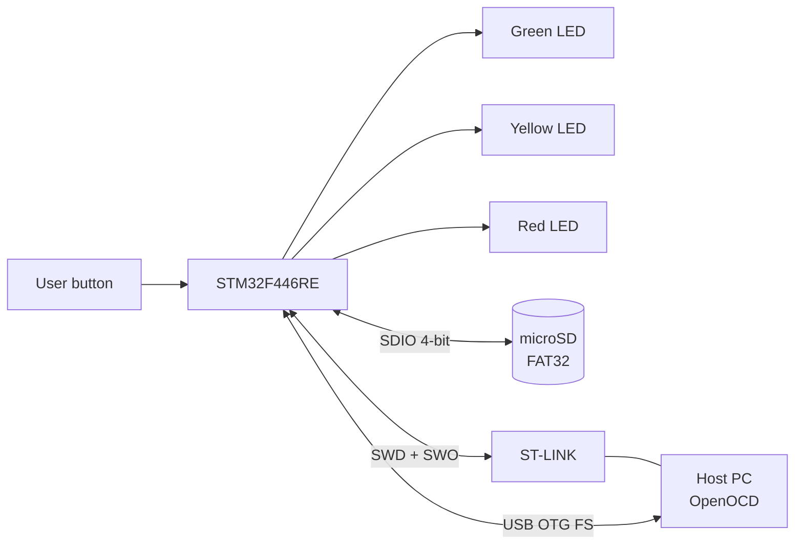
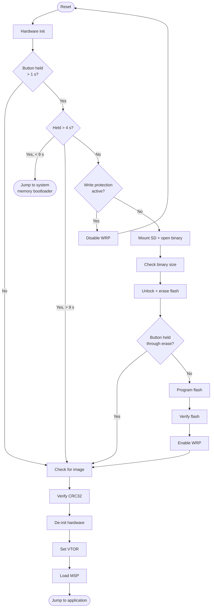

# BootBoot
 
A customizable bare-metal bootloader for the STM32F446. BootBoot performs in-application programming (IAP) of application firmware stored as a binary file on an external microSD card with a FAT32 file system.
 
---
 
## 📑 Table of Contents
 
- [Features](#-features)
- [Hardware Overview](#-hardware-overview)
- [Flash Memory Layout](#-flash-memory-layout)
- [Boot Sequence](#-boot-sequence)
- [Repository Structure](#-repository-structure)
- [Building](#-building)
- [Preparing an Application Image](#-preparing-an-application-image)
- [Programming API](#-programming-api)
- [Configuration](#-configuration)
- [Development Status](#-development-status)
- [References](#-references)
---
 
## ✨ Features
 
- 📦 Configurable application region, defined once in the linker scripts and `memory_map.h`
- 🧹 Sector-based flash erase of the application region
- ✍️ 32-bit word flash programming
- 🔍 Read-back verification of flash contents against the source file after programming
- ✅ CRC32 image checksum verification before every application launch (STM32 hardware CRC unit)
- 🔒 Per-sector write-protection check, enable, and disable through the flash option bytes
- 🛡️ Explicit error handling on every stage, with a fail-safe path that never jumps to an unverified image
- 🔄 Software entry into ST's built-in system memory bootloader (no BOOT0 pin toggle required), for bootloader self-update or full chip reprogramming
- 🐞 SWO trace output for debugging and development
- 🧩 Hardware-specific code isolated behind a small platform layer to simplify porting to other STM32 parts
---
 
## 🔧 Hardware Overview
 
BootBoot is developed on an STM32F446RE (Cortex-M4F, 512 KB flash, 128 KB SRAM). The microSD card connects over the SDIO peripheral in 4-bit mode. A single user button selects the boot mode, and three status LEDs report progress and errors. Programming and debugging use SWD through an ST-LINK probe with OpenOCD.
 

 
LED and button pin assignments are set in `bootboot_config.h`.
 
---
 
## 🗺️ Flash Memory Layout
 
STM32F4 flash is organized in sectors of unequal size, so every region boundary sits on a sector boundary. By default the bootloader occupies sectors 0–1 (32 KB) and the application uses sectors 2–7 (480 KB).
 
| Region        | Sectors | Start address | End address  | Size   |
|---------------|---------|---------------|--------------|--------|
| Bootloader    | 0–1     | `0x08000000`  | `0x08007FFF` | 32 KB  |
| Application   | 2–7     | `0x08008000`  | `0x0807FFFF` | 480 KB |
 
The addresses are defined in `linker/common_regions.ld` and mirrored for C code in `include/memory_map.h`, so the linker and the firmware share a single source of truth.
 
---
 
## 🚀 Boot Sequence
 
On reset, the bootloader initializes the clocks, GPIO, and CRC unit, flashes all three LEDs for one second, then samples the user button to choose a mode.
 
### ▶️ Normal boot (button not pressed)
 
1. Checks that the application region holds a plausible image: the initial stack pointer must point into SRAM, and the reset vector must point into the application region.
2. If checksum verification is enabled, computes CRC32 over the image and compares it with the 4-byte trailer at the end of the image. A mismatch turns on the red LED and halts instead of jumping.
3. Prepares the jump: de-initializes the used peripherals, stops SysTick, disables and clears pending interrupts, and sets `SCB->VTOR` to the application base.
4. Loads MSP from the application's vector table and branches to its reset handler.
### 💾 Firmware update (button released within 4 seconds)
 
1. **Write-protection check.** If any application sector is write-protected, the red LED turns on and the yellow LED blinks for 5 seconds. Pressing the button during this window clears the nWRP bits for those sectors in the option bytes and triggers a system reset. The update must then be started again with the button.
2. **Open the image.** Mounts the FAT32 volume with FatFs and opens the configured application binary.
3. **Size check.** Rejects files larger than the application region.
4. **Unlock flash.** Unlocks the flash control register and clears stale error flags.
5. **Erase.** Erases the application sectors with the yellow LED on. Holding the button until the erase finishes cancels programming, which is useful when you only want to wipe the application.
6. **Program.** Streams the file into flash in 32-bit words with the green LED blinking.
7. **Verify.** Re-reads the file from the start and compares it word by word against flash.
8. **Re-protect.** Restores write protection on the application sectors if enabled in the configuration.
9. **Launch.** Continues with the normal boot path above.
### 🔄 System bootloader (button held 4–9 seconds)
 
Enters ST's built-in bootloader in system memory (`0x1FFF0000`). BootBoot writes a magic value to a `.noinit` RAM word and performs a software reset. Early in startup, before any clock or peripheral setup, it detects the flag, clears it, and jumps to system memory, so the ROM bootloader sees a clean reset state. From there the device can be reprogrammed over USB DFU or USART, including the bootloader region itself (see AN2606).
 
### ⏭️ Skip (button held longer than 9 seconds)
 
Behaves exactly like a normal boot.
 

 
---
 
## 📁 Repository Structure
 
```
bootboot/
├── cmake/
│   ├── arm-none-eabi.cmake   # Cross-compilation toolchain file
│   └── stm32f4.cmake         # MCU flags (Cortex-M4, FPU, float ABI)
├── linker/
│   ├── common_regions.ld     # Bootloader/application region definitions
│   └── stm32f446.ld          # Device linker script
├── include/
│   ├── bootboot_config.h     # User configuration
│   └── memory_map.h          # C view of the linker regions
├── src/                      # Bootloader sources
├── third_party/              # CMSIS, STM32F4 HAL/LL, FatFs
├── tools/                    # Image packaging (CRC32 trailer)
├── .clang-format
└── CMakeLists.txt
```
 
---
 
## 🛠️ Building
 
Requirements: `arm-none-eabi-gcc`, CMake 3.20+, Ninja or Make, OpenOCD.
 
```sh
cmake -B build -G Ninja -DCMAKE_TOOLCHAIN_FILE=cmake/arm-none-eabi.cmake
cmake --build build
openocd -f interface/stlink.cfg -f target/stm32f4x.cfg \
        -c "program build/bootboot.elf verify reset exit"
```
 
---
 
## 📦 Preparing an Application Image
 
The application must be linked to run from the application region and must place its vector table there.
 
- 📍 Set the `FLASH` origin in the application's linker script to `0x08008000`, with length `480K`.
- 🧭 Set the vector table offset. In `system_stm32f4xx.c`, define `USER_VECT_TAB_ADDRESS` and set `VECT_TAB_OFFSET` to `0x8000`, or write `SCB->VTOR = 0x08008000;` early in the application's startup. Without this, interrupts will vector into the bootloader.
- 📄 Export a raw binary: `arm-none-eabi-objcopy -O binary app.elf app.bin`.
If checksum verification is enabled, append a 4-byte CRC32 trailer computed over the entire binary. The parameters match the STM32 hardware CRC unit:
 
| Parameter     | Value                      |
|---------------|----------------------------|
| Polynomial    | `0x04C11DB7`               |
| Initial value | `0xFFFFFFFF`               |
| Input         | 32-bit words, not reflected |
| Output        | Not reflected, no final XOR |
| Size          | 4 bytes, appended to image |
 
`tools/` contains a script that pads the binary to a 4-byte boundary and appends the trailer. Copy the result to the root of the SD card under the file name set in `bootboot_config.h`.
 
---
 
## 🔌 Programming API
 
The flash layer can be reused for update transports other than the SD card, such as UART, CAN, or a wireless module. A programming session must follow this order:
 
1. 🔓 `bootboot_wrp_get()` / `bootboot_wrp_set()`: check the application sectors' write protection and clear it if needed.
2. ⚙️ `bootboot_flash_init()`: unlock the flash control register and clear error flags.
3. 🧹 `bootboot_flash_erase()`: erase all application sectors (optional but recommended).
4. ▶️ `bootboot_flash_begin()`: reset the write pointer to the start of the application region.
5. ✍️ `bootboot_flash_write(uint32_t word)`: program one 32-bit word and advance the write pointer. Call this repeatedly until the image is written.
6. ⏹️ `bootboot_flash_end()`: lock the flash control register.
All functions return a `bootboot_status_t` error code.
 
---
 
## ⚙️ Configuration
 
All options are in `include/bootboot_config.h`, and each is documented inline. The main options are:
 
- 📄 Application file name on the SD card
- ✅ Enable or disable CRC32 verification
- 🔒 Enable or disable write protection after programming
- ⏱️ Button timing thresholds (1 s / 4 s / 9 s)
- 💡 LED and button GPIO assignments
- 🐞 Enable or disable SWO trace output
---
 
## 🚧 Development Status
 
- [x] CMake cross-compilation toolchain (`arm-none-eabi.cmake`, `stm32f4.cmake`)
- [x] Linker scripts and memory map (`common_regions.ld`, `stm32f446.ld`, `memory_map.h`)
- [ ] Startup code and jump-to-application
- [ ] Flash driver (unlock, sector erase, word program, write protection)
- [ ] SDIO + FatFs integration
- [ ] Image read-back verification and CRC32 check
- [ ] Button/LED boot-mode state machine
- [ ] System memory bootloader entry
- [ ] SWO trace output
- [ ] Image packaging tool
**Planned after the core IAP path:** ECDSA-signed images, A/B slots with rollback, and additional update transports (UART, CAN).
 
---
 
## 📚 References
 
- 📘 RM0390: STM32F446xx reference manual (flash interface, option bytes, SDIO, CRC)
- 📗 DS10693: STM32F446xC/E datasheet
- 📙 PM0214: STM32 Cortex-M4 programming manual (VTOR, MSP, exception model)
- 📕 AN2606: STM32 microcontroller system memory boot mode
- 📓 UM1725: Description of STM32F4 HAL and low-layer drivers
- 📒 FatFs generic FAT file system module, ChaN (elm-chan.org)
---
 
## 👤 Author
 
**Mervin Nguyen**
Embedded Systems Engineer. Focus: RTOS, low-level firmware, performance-critical systems.
 
## 📄 License
 
MIT
